# [Still in process as of 10/3/2022] Heuristic Evaluation of Sustainable Cities and Communities Related Sites
Cari Jung • DH110 • Fall 2022

{This project is about...}

### Jakob Nielson's [10 Usability Heuristics](https://www.nngroup.com/articles/ten-usability-heuristics/) 

| Number | Heuristic | Description |
|---|---|---|
| 1 | Visibility of System Status | Users should always be informed through appropriate feedback |
| 2 | Match Between System and the Real World | Users should understand the language. Design should follow real-world conventions |
| 3 | User Control and Freedom | Design should clearly allow users to exit an unwanted process and prevent them from getting stuck |
| 4 | Consistency and Standards | Design should be consistent across the platform so users don't wonder if diferent words, situations, and actions mean the same thing |
| 5 | Error Prevention | Eliminate error-prone conditions or display a confirmation option to users. |
| 6 | Recognition Rather Than Recall | Minimize user's cognitive load by making options visible |
| 7 | Flexibility and Efficiency of Use | Design caters to both experienced and inexperienced users. Allow users to tailor frequent actions |
| 8 | Aesthetic and Minimalist Design | Provide relevant features in interface |
| 9 | Help Users Recognize, Diagnose, and Recover From Errors | Platform expresses error messages, precisely indicates the error, and makes suggestions  |
| 10 | Help and Documentation | Supply users with extra documentation and assitance |

 
&nbsp;

 
 ### Severity Ratings
| Rating | Description |
|---|---|
| 1 | Cosmetic Problem, lowest priority|
| 2 | Minor usability problem, mid priority |
| 3 | Major usability problem, highest priority |
 
 
&nbsp;

 
# Website #1: [UN Environment Programme](https://www.unep.org/)

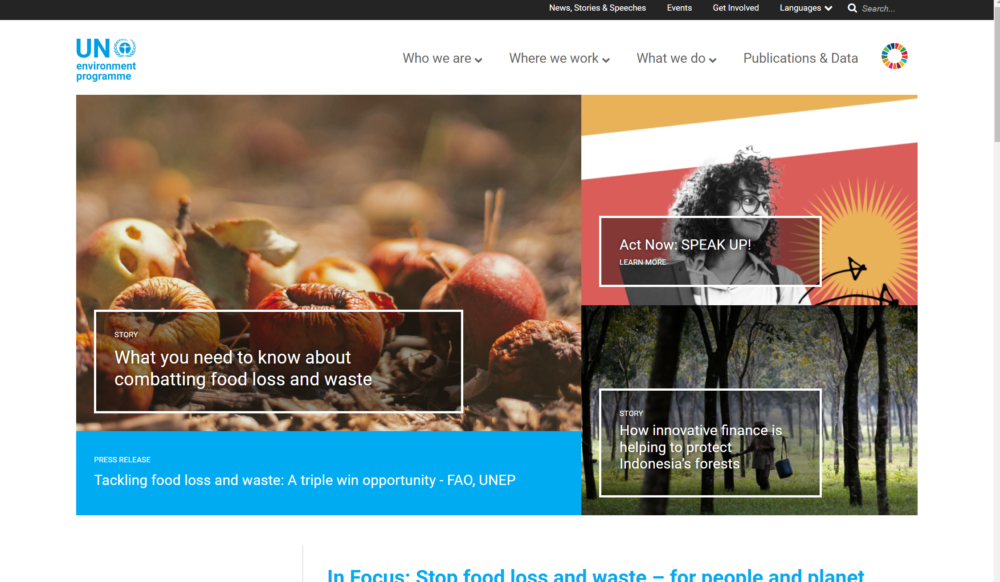

&nbsp;

#### Background Information
UNEP aims to advocate for the quality of life and provide necessary resources to countries to ensure sustainability. Moreover, they provide various resources to inform those with access to internet about planetary crises and ways for them to get involved through their website. 

&nbsp;

#### Initial Heuristic Evaluation
My inital reaction when visiting this site was that it was easy to navigate thanks to the navigation bars located at the top of the page. The structure of the visualizations for each page remained the same while only the visualizations changed to fit the concept of the page. However, because there was immense amount of information, I wish there were subtabs I could use to navigate to specific resources immediately. Furthermore, I wasn't sure about the purpose of the search bar and found that some illustrations and phrases were clickable and led to more resources even when there were no indicators that they were clickable. 

&nbsp;

## Heuristic Evaluation of UN Environment Programme

## 1. Visibility of System Status

### • Navigation tab
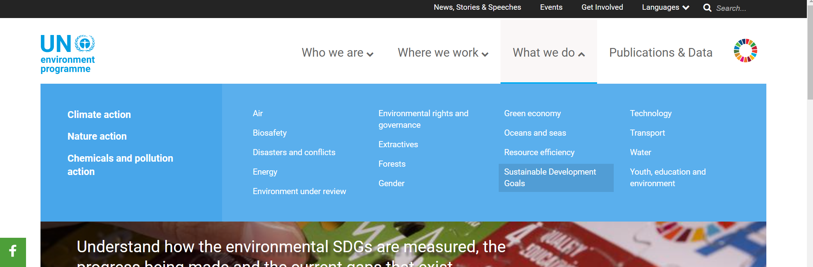

| Severity Rating | Evaluation |  
|---|---|
| Good | When cursor is hovered above the navigation tabs the color changes, indicating that it is clickable. Additionally, the changes in the color allows users to indicate which tab they are currently viewing. These enhance user interactability with the site.|

&nbsp;

### • Search bar
   
| Severity Rating | Evaluation |  
|---|---|
| 1 | Search bar does not display recommended searches or potential results. Instead, it only displays the previously searched phrases. The "Search" placeholder text is vague as users might potentially get confused about where the search will navigate them to. Because the search leads to a page displaying resources, "Search resources" or "Search articles" might be a better option. |

&nbsp;

### • "What we do" tab

| Severity Rating | Evaluation |
|---|---|
| 3 | User's initial response can potentially be that this is just a list of what the organization does. However, it is clickable and leads to many more resources that users can miss because there are no indications like arrows, bolded letters, or underlines. Including at least one of these indicators is a possible solution. |

&nbsp;

## 2.  Match Between System and the Real World
### • Navigation tab
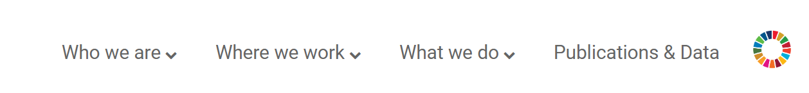
| Severity Rating | Evaluation |
|---|---|
| Good | The navigation tab does not use jargons but instead uses easy to understand phrases like "What we do" do to help users easily navigate the site. |

&nbsp;

### • Parallax Scrolling page 
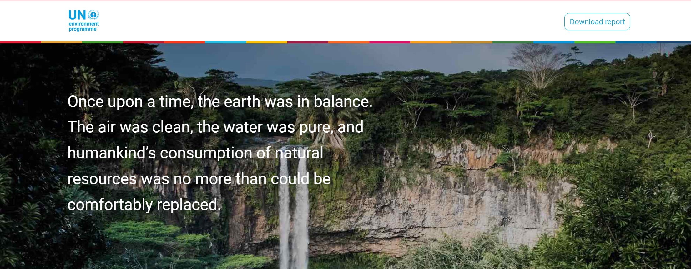
| Severity Rating | Evaluation |
|---|---|
| 1 | There is no indication for users to scroll horizontally or vertically which can cause confusion in users. A sign stating "Press '>' to continue" or "Scroll down" would be a helpful solution. |

&nbsp;

### • "National Scorecard" page
 

| Severity Rating | Evaluation |
|---|---|
| 3 | "National Scorecard" is a jargon that many users might not recognize. Instead, using "Sustainable Development Goals by Country" that will tell users that they would be able to view the seventeen goals is a possible solution. Also, because clicking on "National Scorecard" leads to many resources like the progress of each country and details about each sustainable development goal, implementing a drop down menu displaying options like "Sustainable Development Goals" and "Progress by Country" is a recommended solution. |

&nbsp;

## 3. User Control and Freedom
### • "Subscribe to the UNEP Newsletter" page
 

| Severity Rating | Evaluation |
|---|---|
| 3 | If users desire to choose more options after submitting their request, the only way to choose more options is to reiterate the process of inputting their email, first name, last name, and choosing their options. There is no sign that they have already chosen their option so this might promt users to reselect their past choices. A potential solution would be giving users a sign that tells them that they have already subscribed to certain newsletters if they already have. This can be accomplished through making the already subscribed options unclickalble or simply show "subscribed" next to the options.|

&nbsp;

## 4. Consistency and Standards
### • Parallax scrolling page 

| Severity Rating | Evaluation |
|---|---|
| 3 | Consistancy is lost as navigation bar disappears, which makes this page look like an external site. Users are required to click the back button to explore more tabs. Including the navigation bar is recommended.|

&nbsp;

## 5. Error Prevention

### • Search results
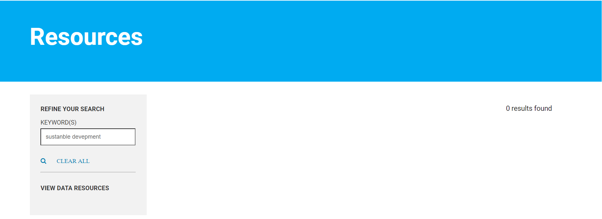
| Severity Rating | Evaluation |
|---|---|
| 3 | There is no typo indicator or autofill suggestions. Instead, when users make a typo, they are given no results or different/unrelated search results that can misguide them. Implementing an algorithm that helps detect typos and displaying "Did you mean _________" on the screen will notify users of their error and help them achieve thier desired results. |

&nbsp;

## 6. Recognition Rather Than Recall

### • Search bar
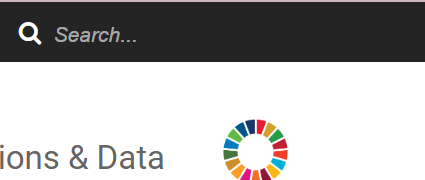
| Severity Rating | Evaluation |  
|---|---|
| 1 | The function of the "Search" tab is vague as users do not know whether they can find subheadings, articles, or contact information using the search tab. Because the search leads to a page displaying resources, "Search resources" or "Search articles" might be a better option. |

&nbsp;

## 7. Flexibility and Efficiency of Use

### • Navigation tab
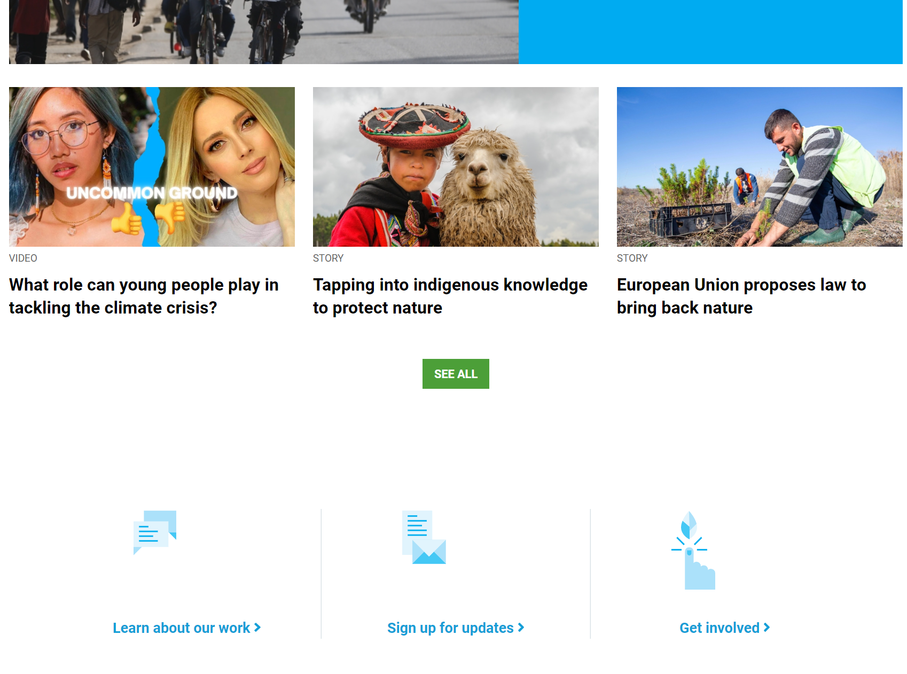
| Severity Rating | Evaluation |  
|---|---|
| 1 | As user scroll down, the navigation tab disappears, which requries users to scroll all the way to the top to navigate to another page or explore more options. A potential solution would be to always make navigation tab visible regardless of where on the site users might be. |

&nbsp;

## 8. Aesthetic and Minimalist Design

### • Footer

| Severity Rating | Evaluation |  
|---|---|
| 1 | Users expect to find contact information and other legal pages at the footer of the website. However, because the fonts are small and colored in a slightly lighter shade than the background, users experiencing vision troubles will have a hard time locating these information. Changing the font to white like the rest of the information at theh footer and increasing the font size is a potential solution.|

### • Visualization
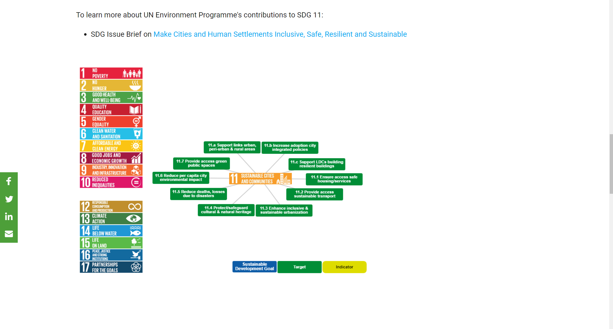
| Severity Rating | Evaluation |  
|---|---|
| 2 | This page has enough space to increase the size of this interactive visualization, yet it is small compared to the whole page. A potential solution would be to increase the size of this visualization and the font so users don't have to zoom in to view the informations.|

&nbsp;

## 9. Help Users Recognize, Diagnose, and Recover From Errors

### • "Subscribe to the UNEP Newsletter" page
 

| Severity Rating | Evaluation |
|---|---|
| 3 | Although the user inputs an invalid email, it gives them a notification that they have successfully subscribed to receiving the newsletter. A potential solution would be to check if the email is valid by asking users to confirm their email. |

&nbsp;

## 10. Help and Documentation
### • No FAQ page
| Severity Rating | Evaluation |
|---|---|
| 3 | This site does not include a FAQ page and users are expected to contact them to get their questions answered. Because there is no guarantee how long they would need to wait to get a response and a FAQ page can help them immediately, implementing a FAQ page on the "contact us" page or the footer will be a helpful solution that saves time for the resondents as well.|

&nbsp;

&nbsp;

# Website #2: [Institute for Sustainable Communities](https://sustain.org/blog/)

&nbsp;

#### Background Information
The Institute for Sustainable Communities believes that climate change, income inequality, and social injustice are the biggest obstacles in building a sustainable community. A sustainable community is about allowing people to feel safe, welcomed, giving them the chance to express their voices for significant decision makings, and promising resources to future generations. Additionally, the ISC creates leaders who will help tackle urgent challenges of urbanization and climate disruptions.

&nbsp;

#### Initial Heuristic Evaluation 
My initial evaluation about this site is that it is very easy to navigate as there were no jargons and the navigation tabs were organized. I felt comfortable viewing this website because it expressed minimality 
confused between which tabs will directly lead me to a page instead of showing a drop down menu, which prompted me to go back and reiterate the process. 

&nbsp;

## Heuristic Evaluation of Institute of Sustainable Communities
## 1. Visibility of System Status

### • Navigation tabs
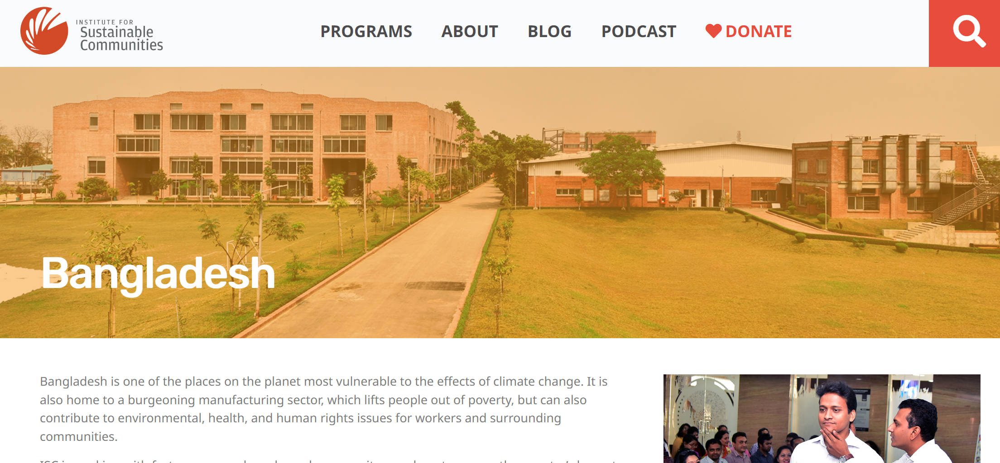
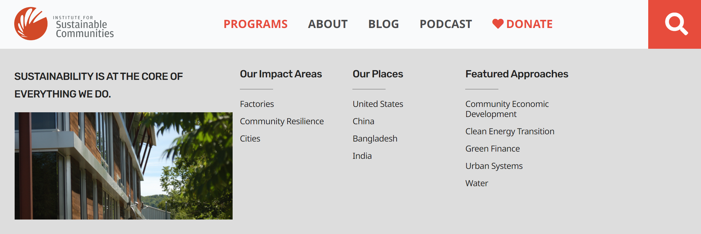

| Severity Rating | Evaluation |  
|---|---|
| 3 | The navigation bar changes color only when the cursor is hovered above each option. The subtabs are uncolored as well which makes it hard for users to indicate which page they are on. Making the navigation tabs change color is suggested.| 

&nbsp;

### • Page Number

| Severity Rating | Evaluation |
|---|---|
| 1 | Users must view the tab of their computer to see which page they are no indicators that tell users which page they are viewing. Making the page number bold and listing the page numbers horizontally is an ideal solution. |

&nbsp;

## 2. Match Between System and the Real World
### • Jargons

| Severity Rating | Evaluation |
|---|---|
| 1 | Navigation tab includes jargons like "community resilience" and "green finance" that potentially prompts users to click on these tabs to figure out what they mean. Instead, replacing these jargons with "recovering communities" and "investments to support sustainability" might be a better choice.|

&nbsp;

## 3. User Control and Freedom
### • Search icon

| Severity Rating | Evaluation |
|---|---|
| 1 | Although the search icon itself is clickable, the red background the search icon is located in is unclickable. This causes confusion in users especially when they initially click on the red background hoping to make searches. If users don't make an another attempt to move their cursor to click on the white icon, they might gain the misunderstanding that the search icon is defective. To give users more freedom, making the entire icon (the white search icon + the red background) clickable is recommended. |

&nbsp;

                                           
## 4. Consistency and Standards
### • Inconsistency in Navigation Tabs
                                           
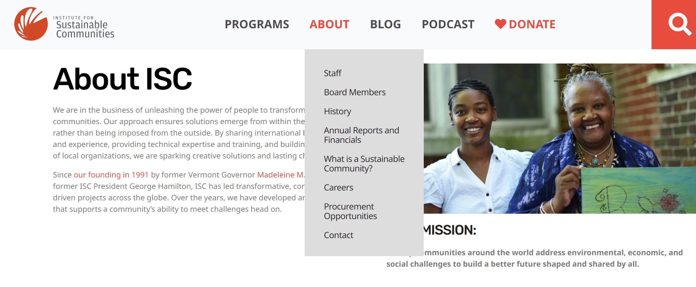
| Severity Rating | Evaluation |
|---|---|
| 3 | When users click "Program", a drop down menu appears. However, when "About" is clicked, it takes users to the "About ISC" page. To view the drop down menu of "About", users must hover their cursor on it instead of clicking on it. To prevent these inconsistencies, making sure a drop down menu appears when "About" is clicked and making a new tab called "About ISC" in the drop down menu is a potential solution. |

&nbsp;

## 5. Error Prevention
### • Subscribe to Newsletter

| Severity Rating | Evaluation |
|---|---|
| 2 | Users aren't told what information they are supposed to input in the tab. To ensure that users feel in control and an error doesn't occur in the first place, inputing placeholder texts like "Email" would be useful. Additionally, displaying confirmation actions so users know whether the newsletter was sent to the correct email, is suggested.|

&nbsp;

## 6. Recognition Rather Than Recall

| Severity Rating | Evaluation |  
|---|---| 
| 1 | Users have to recall the title of the blog that interested them. Adding a bookmarking option is suggested. |

&nbsp;

## 7. Flexibility and Efficiency of Use
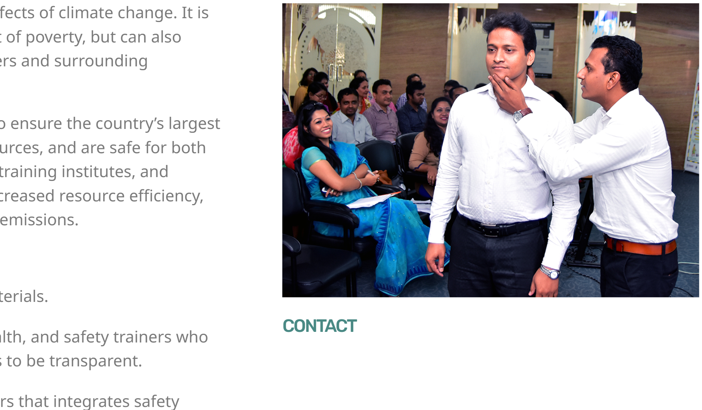
### • Unclickable "Contact" menu

| Severity Rating | Evaluation |  
|---|---|
| 2 | The random bolded 'contact' text misleads users into thinking it might be clickable to view contact information. However, it is not clickable and removing this would improve efficiency of use. |

&nbsp;

## 8. Aesthetic and Minimalist Design

### • Font, Color, and Images
| Severity Rating | Evaluation |  
|---|---|
| Good | This site maintains minimality by not using various text colors and front sizes. The sizes of pictures remain constant throughout the pages. |

&nbsp;

## 9. Help Users Recognize, Diagnose, and Recover From Errors

### • Subscribe to Newsletter 
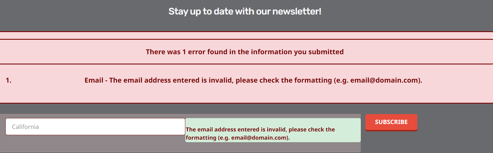
| Severity Rating | Evaluation |
|---|---|
| Good | Although the input tab does not explicitly state what information users should input, when users input other information other than their emails, they are given immediate feedback and is told how to format their input. Their previous input does not get deleted which allows them to view and correct their mistakes without having to type their response from the very beginning. This prevents the reiteration of inputting wrong information. |

&nbsp;

## 10. Help and Documentation
### • Contact Information not Visible

 
                      
| Severity Rating | Evaluation |
|---|---|
| 3 | The only method of communication seems to be through emailing specific staff members. There is no contact option visible in the footer (usually where these informations are located). Instead, users have to navigate to the "Staff" page or click "ISC Staff" in the footer to obtain emails for specific members. It is also hard for users who aren't familiar with the listed roles like "Senior Program Officer" to determine who to send an email to. Adding an FAQ page and an indiator on who users should contact for their queries is recommended. |

